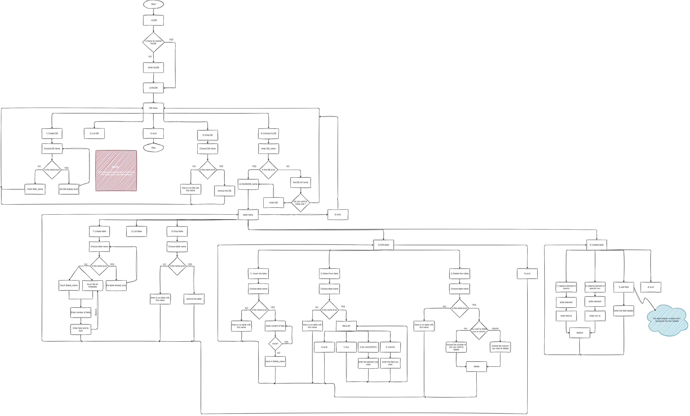

# Database Management System (DBMS) Simulator

## Overview

The Database Management System (DBMS) Simulator is a project developed using Bash scripting to simulate the functionality of a database management system. It provides an effective solution for managing databases through command-line interactions.

## Features

- **Database Creation:** Allows users to create databases with specified names.
- **Table Management:** Supports the creation, modification, and deletion of tables within databases.
- **Data Manipulation:** Enables users to insert, update, delete, and query data within tables.
- **Query Optimization:** Implements basic query optimization techniques for improved performance.

## How to Use

1. **Clone the Repository:** Clone the project repository to your local machine using Git:
git clone https://github.com/mohamedmelrayes/DBMS.git

2. **Navigate to the Directory:** Enter the directory of the cloned repository:
cd dbms-simulator

3. **Run the Simulator:** Execute the Bash script to start the DBMS Simulator:
./mainmenu.sh

4. **Follow the Instructions:** Follow the on-screen instructions to create databases, tables, and perform data manipulation tasks.

## Getting Started

To get started with the DBMS Simulator, ensure you have Bash installed on your system. Clone the repository and run the provided Bash script to start simulating database management tasks.

## Contributions

Contributions to the DBMS Simulator project are welcome! If you would like to contribute, please follow these steps:

1. Fork the repository.
2. Create a new branch (`git checkout -b feature/your-feature`).
3. Make your changes.
4. Commit your changes (`git commit -am 'Add new feature'`).
5. Push to the branch (`git push origin feature/your-feature`).
6. Create a new Pull Request.

## License

This project is licensed under the MIT License - see the [LICENSE](LICENSE) file for details.
